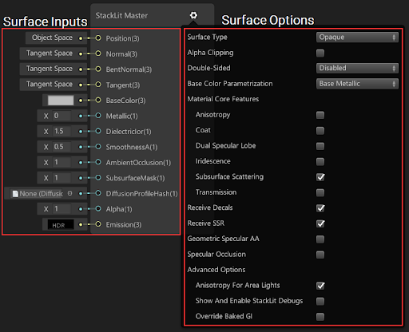
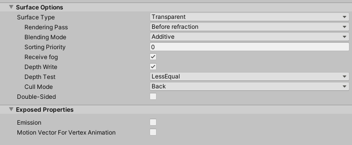

# Customizing HDRP materials with Shader Graph

The High Definition Render Pipeline (HDRP) uses Unity's [Shader Graph](<https://docs.unity3d.com/Packages/com.unity.shadergraph@latest/index.html?preview=1>) for all of its Shaders, except the AxF Shader. This means that, for [some Materials](#MaterialList), you do not create and edit them in the same way as normal Materials.

## HDRP Materials that use Shader Graph

HDRP includes the following Shader Graphs:

- Decal
- Fabric
- Hair
- Lit
- StackLit
- Unlit

The [Lit](Lit-Shader), LayeredLit, and [Unlit](Unlit-Shader) Shaders are available as standard Shaders (without Shader Graph). This means that you can use them without creating a Shader Graph instance, and edit them in the Inspector. To use these, select a Material to view it in the Inspector and click on the **Shader** drop-down. Go to the **HDRP** section to see a list of every HDRP Shader that does not require a Shader Graph instance.

## Creation

To create a Material that uses a Shader Graph (for example, a StackLit Graph), follow these steps:

1. Create a Shader with the Shader Graph that you want the Material to use.
	1. Go to **Assets > Create > Shader > HDRP** to find the list of HDRP Shader Graphs. For this example, click **StackLit Graph**.
   1. Give the Shader Graph a unique name. This is important, because you need to reference this Shader Graph in the Material.
1. Create a Material from the Shader.
1. In your Project window, find the Shader that you just created and right-click it.
   1. Select **Create > Material**. This creates a Material that uses the Shader you selected. It is very important to do it this way; do not create a default Material and then select the Shader in the Material's **Shader** drop-down. For information on why, see [Known issues](#KnownIssues).
   1. Give the Material a name and press *Return* on your keyboard.

## Editing

To edit properties for Materials that use Shader Graphs, the Inspector window only allows access to a limited number of properties. To edit all Material properties, you must directly edit the Shader Graph's Master Node.

1. Double-click on the Shader Graph Asset to open it. The window displays the Master Node and a list of the available inputs. See these in the **Surface Inputs** section of the screenshot below.
2. To expose the rest of the properties, click on the cog in the top right of the Master Node. See these other properties in the **Surface Options** section of the screenshot below.
3. Edit the values for the cog's properties in the same way as you would do in the Inspector window. The list of inputs on the Master Node, and the available properties in the cog's list, changes depending on what options you select.

## Material properties

When you edit a Shader Graph Asset, you can create properties on the [Blackboard](https://docs.unity3d.com/Packages/com.unity.shadergraph@latest/index.html?subfolder=/manual/Blackboard.html) for Materials that use it. This allows you to change the value of the property at runtime. 

The best way to create a property depends on how you want to use it:

- If you want the ability to edit the property in the Editor, use the Blackboard, and expose the property.
- If you want the ability to edit the property at runtime, but not in the Editor, use the Blackboard, but don’t expose the property.
- If you don’t want to edit the property, [use a concrete node](#ConcreteNodes).

### Material properties in the Blackboard

Every Blackboard property contributes to the size of the Material on disk, whether you expose it or not. If you do not need the value of the property to change at all (either in the Editor or at runtime), use a concrete node instead, so that it doesn’t add to the size of the Material.

If you want to change the value of a Material’s property in the Unity Editor Inspector, you need to expose that property. To expose a property on the Blackboard to the Inspector:

1. Open the Shader Graph Asset that the Material is using.
2. Go to the Blackboard and enable the Exposed setting for the properties that you want to see in the Inspector.
3. In the toolbar, click Save Asset.
4. When you create a Material from the Shader Graph Asset, the properties appear in the Exposed Properties section.

You should only expose a property if you intend to change it in the Inspector while you develop your application in the Editor. Otherwise, it’s good practice to leave it unexposed, so that it doesn’t take up too much space in the Inspector, and it can’t accidentally change.

If a property is not exposed, you can still edit it. To edit the property for every Material instance that uses the selected Shader, open the Shader Graph Asset and edit the property directly in the Blackboard. To edit the property for a single Material instance that uses the Shader, use a script. 

### Material properties in concrete nodes

If you want a property value to be the same for every Material that uses the Shader, and you don’t need to change it at runtime or in the Editor, you can use a concrete node. A concrete node is a node that you can create in the Shader Graph Asset that defines a value. You can create concrete nodes for all of the same value types as you can in the Blackboard. You should use concrete nodes whenever possible, because the Shader compiler can perform automatic optimisations to improve performance.

Concrete nodes that define a Texture (or a Texture array) define an unexposed property in the Shader. This means that they contribute to the size of the Material on disk, just like Blackboard properties.

### Material Surface Option properties

By default HDRP master nodes exposes a bunch of **Surface Options** properties, they allow you to control common settings from the Material instead of in the ShaderGraph and thus avoid having to duplicate the whole graph to change for example the **Sorting Priority** or the **Surface Type**. In the master node, these settings act as a default value in the Shader so when you create a material from the **Shader Graph** (**Right Click on the Shader Graph asset > Create > Material**) it will have the configuration of the master node.  

This system is great to avoid duplicating graphs but it have some problem related to the synchronization of properties. For example if you create a material from a Transparent **Shader Graph** and then decide to switch the **Surface Type** to Opaque in the master node settings, then the created material will still be Opaque. Once you created the material, all it's properties are saved and never synchronized back with the **Shader Graph**, even if you didn't changed anything on the material (mainly because there is no override system).

**Note that switching these surface options is only possible in edit mode, not in the player.** Thanks to this, it doesn't add any extra variants to the shader compilation process (we use shader features instead of multi compiles).

## Known issues

- When you create a new Material, it must inherit from the default Shader Graph properties (in the Master Node settings). To do this, you must use the method described in the [Creation](#Creation) section. If you don’t do this, and instead use **Assets > Create > Material** to create a Material, Unity assigns the Lit Shader to the Material and then writes all the default Lit Shader properties to it. This means that, when you assign the Shader Graph to the Material, the Material uses the default properties from the Lit Shader instead of those from the Shader Graph Master Node.

- When you modify the properties of the Master Mode in a Shader Graph, Unity does not synchronize them with Materials unless the Material is open in the Inspector. This means that, when you change certain properties in the Master Node settings, like **Material Type**, Materials that are not open in the Inspector fall out of sync, which breaks the rendering of these Materials. To fix the rendering and synchronize the properties of a Material with its Shader Graph, you can do the following:

- - Open the Material in the Inspector, change the value of one of its properties, and then change it back. This triggers a sync between the master node and the Material, and fixes the Material.
  - Call `HDEditorUtils.ResetMaterialKeywords(Material)` from a C# script in your Project. This synchronizes the properties of the Material you pass in with the Material's Shader Graph.