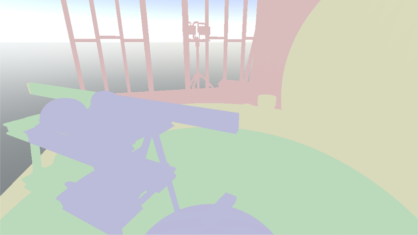

# Shadows

The **Shadows** [Volume component override](Volume-Components.html) controls the maximum distance at which HDRP renders shadow cascades and shadows from [punctual lights](Glossary.html#PunctualLight). It uses cascade splits to control the quality of shadows cast by Directional Lights over distance from the Camera.

The **Shadows** override comes as default when you create a **Scene Settings** GameObject (Menu: **GameObject > Rendering > Scene Settings**). You can also manually add a **Shadows** override to any [Volume](Volumes.html). Select the Volume component in the Scene or Hierarchy to view it in the Inspector, then navigate to **Add Override > Shadowing** and click on **Shadows**.

## Properties

| **Property**      | **Description**                                              |
| ----------------- | ------------------------------------------------------------ |
| **Working Unit**  | Use the drop-down to select the unit that you want to use to define the cascade splits. **Metric**: Defines cascade splits in meters. **Percent**: Defines cascade splits as a percentage of **Max Distance**. |
| **Max Distance**  | The maximum distance (in meters) at which HDRP renders shadows. HDRP uses this for punctual Lights and as the last boundary for the final cascade. |
| **Cascade Count** | The number of cascades for Direction Lights that can cast shadows. Cascades work as levels of detail (LOD) for shadows. Each cascade has its own shadow map, and the cascade area gets progressively larger as they get further from the Camera. HDRP spreads the same resolution shadow map over each cascade area, so cascades closer to the Camera have higher quality shadows than those further from the Camera. |
| **Split 1**       | The distance of the split between the first and second cascades. The **Working Unit** defines the unit this property uses. |
| **Split 2**       | The distance of the split between the second and third cascades. The **Working Unit** defines the unit this property uses. |
| **Split 3**       | The distance of the split between the third and final cascades. The **Working Unit** defines the unit this property uses. |

## Visualizing the shadow cascades

The Shadows override also allows you to visualize the cascade sizes in the Inspector, as well as the boundaries of the cascades as they appear inside your Scene in real time.

In the Inspector, the **Cascade Splits** bar allows you to see the size of each cascade relative to one another. You can also move the position of each cascade split. To do so, click on the tab above a split and drag it to adjust the position of that cascade split.

In the Scene view and the Game view, the cascade visualization feature allows you to see the boundaries of each cascade in your Scene. Each color represents a separate cascade, and the colors match those in the **Cascade Splits** bar. This allows you to see which colored area matches which cascade.

To activate cascade visualization, click the **Visualize Cascades** button. You can now see the shadow maps in the Scene view and the Game view. 

- You can use the Scene view Camera to move around your Scene and quickly visualize the shadow maps of different areas.
- You can use the Game view Camera to visualize the shadow maps from the point of view of the end user. You can use the **Visualize Cascades** feature while in Play Mode, which is useful if you have some method of controlling the Camera’s position and rotation and want to see the shadow maps from different points of view in your Project.