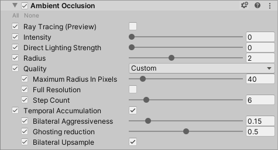

# Ambient Occlusion

The **Ambient Occlusion** override is a real-time, full-screen lighting effect available in the High Definition Render Pipeline (HDRP). This effect approximates [ambient occlusion](https://en.wikipedia.org/wiki/Ambient_occlusion) in the current field of view. It approximates the intensity and position of ambient light on a GameObject’s surface, based on the light in the Scene and the environment around the GameObject. To achieve this, it darkens creases, holes, intersections, and surfaces that are close to one another. In real life, these areas tend to block out, or occlude, ambient light, and therefore appear darker.

For information on how to use a Texture to specify ambient occlusion caused by details present in a GameObject's Material but not on it's surface geometry, see [Ambient Occlusion](Ambient-Occlusion.md).

## Using Ambient Occlusion

**Ambient Occlusion** uses the [Volume](Volumes.md) framework, so to enable and modify **Ambient Occlusion** properties, you must add an **Ambient Occlusion** override to a [Volume](Volumes.md) in your Scene. To add **Ambient Occlusion** to a Volume:

1. In the Scene or Hierarchy view, select a GameObject that contains a Volume component to view it in the Inspector.
2. In the Inspector, navigate to **Add Override > Lighting** and click on **Ambient Occlusion**. 
   HDRP now applies **Ambient Occlusion** to any Camera this Volume affects.

## Properties

[!include]

| **Property**                 | **Description**                                              |
| ---------------------------- | ------------------------------------------------------------ |
| **Intensity**                | Use the slider to guide the intensity of the ambient occlusion. Higher values lead to darker results. HDRP uses this value as an exponent to evaluate a pixel's final value for ambient occlusion. |
| **Direct Lighting Strength** | Use this slider to change how much the occlusion affects direct diffuse lighting. |
| **Step Count**               | Use the slider to set the number of steps HDRP takes to search for occluders. Increase this value to produce more precise results. This might produce a darker result as HDRP finds more occluders. |
| **Radius**                   | Use the slider to set the distance that HDRP searches around a point for occluders. Set a higher value to make ambient occlusion cover larger scale features. Be aware that a higher distance value often produces a lower quality result. **Note:** HDRP clamps the radius in screen space to the value you set in **Maximum Radius in Pixels**. |
| **Maximum Radius In Pixels** | Use the slider to set an upper limit, in pixels, for the area that HDRP searches for occluders. The numerical value assumes that you are using a resolution of 1920 x 1080. HDRP scales this value accordingly when you use a different resolution.  Keep this value as low as possible in order to achieve good performance. |
| **Full Resolution**          | Enable the checkbox to process the ambient occlusion algorithm in full resolution. This improves quality significantly but is a resource-intensive operation and has an impact on performance. Disable the checkbox to process the ambient occlusion algorithm at half the resolution your application runs at. This setting is disabled by default. |
| **Temporal Accumulation**    | Enable the checkbox to accumulate the result of AO over time. This will lead to better quality, but it might result in artifacts like non instant convergence and ghosting. **Note:** This mode will not lead to good results if motion vectors are not available. |
| **Ghosting Reduction**       | This is only available when Temporal Accumulation is enabled. Moving this factor closer to 0 will increase the amount of accepted samples during temporal accumulation, increasing the ghosting, but reducing the temporal noise. Moving the value closer to 1 will reduce the ghosting, at expense of more visible temporal noise. |
| **Bilateral Upsample**       | Enable the checkbox to upsample the low resolution AO through bilateral upsampling. This preserves sharp edges better, however it is slightly more expensive and might result is more visible aliasing.  **Note:** This mode is available only when Full Resolution is set to false. |
| **Direction Count**       | Determines how many directions are searched for occlusion, increasing this will impact performance considerably.  **Note:** This mode is available only when Temporal Accumulation is set to false. |
| **Blur sharpness**       | Determines the sharpness of the non-temporal blur. Higher values preserve sharp features better (with higher risk of noise), lower values have a softer look. **Note:** This mode is available only when Temporal Accumulation is set to false. |

## Details

Ambient occlusion is a screen-space effect, so it only processes what is on the screen at a given point in time. This means that objects outside of the field of view cannot visually occlude objects in the view. You can sometimes see this on the edges of the screen.
