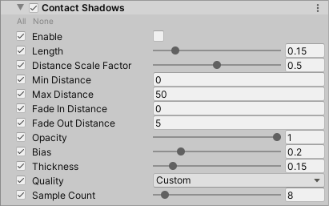

# Contact Shadows
The Contact Shadows [Volume Override](Volume-Components.html) specifies properties which control the behavior of Contacts Shadows. Contact Shadows are shadows that The High Definition Render Pipeline (HDRP) [ray marches](Glossary.html#RayMarching) in screen space inside the depth buffer. The goal of using Contact Shadows is to capture small details that regular shadow mapping algorithms fail to capture.

## Using Contact Shadows

To use Contact Shadows in your Scene, you must first enable them for your Cameras. In the Inspector for your HDRP Asset, go to the **Default Frame Settings > Lighting** section and enable the **Contact Shadows** checkbox. All Cameras can now render Contact Shadows unless you override a Camera’s individual [Frame Settings](Frame-Settings.html).

**Contact Shadows** use the [Volume](Volumes.html) framework, so to enable and modify **Contact Shadow** properties, you must add a **Contact Shadows** override to a [Volume](Volumes.html) in your Scene. To add **Contact Shadows** to a Volume:

1. In the Scene or Hierarchy view, select a GameObject that contains a Volume component to view it in the Inspector.
2. In the Inspector, navigate to **Add Override > Shadowing** and click on **Contact Shadows**. HDRP now applies **Contact Shadows** to any Camera this Volume affects.

You can enable Contact Shadows on a per Light basis for Directional, Point, and Spot Lights. Tick the **Enable** checkbox under the **Contact Shadows** drop-down in the **Shadows** section of each Light to indicate that HDRP should calculate Contact Shadows for that Light.

Only one Light can cast Contact Shadows at a time. This means that, if you have more than one Light that casts Contact Shadows visible on the screen, only the dominant Light renders Contact Shadows. HDRP chooses the dominant Light using the screen space size of the Light’s bounding box. A Directional Light that casts Contact Shadows is always the dominant Light.

**Note**: A Light casts Contact Shadows for every Mesh Renderer that uses a Material that writes to the depth buffer. This is regardless of whether you enable or disable the **Cast Shadows** property on the Mesh Renderer. This means that you can disable **Cast Shadows** on small GameObjects/props and still have them cast Contact Shadows. This is good if you do not want HDRP to render these GameObjects in shadow maps. If you do not want this behavior, use Shader Graph to author a Material that does not write to the depth buffer.

## Properties

| Property                  | Description                                                    |
| :------------------------ | :----------------------------------------------------------- |
| __Enable__                | Enable the checkbox to make HDRP process Contact Shadows for this [Volume](Volumes.html).       |
| __Length__                | Use the slider to set the length of the rays, in meters, that HDRP uses for tracing. It also functions as the maximum distance at which the rays can captures details. |
| __Distance Scale Factor__ | HDRP scales Contact Shadows up with distance. Use the slider to set the value that HDRP uses to dampen the scale to avoid biasing artifacts with distance. |
| __Min Distance__ | The distance from the Camera, in meters, at which HDRP begins to fade in Contact Shadows. |
| __Max Distance__          | The distance from the Camera, in meters, at which HDRP begins to fade Contact Shadows out to zero. |
| __Fade In Distance__ | The distance, in meters, over which HDRP fades Contact Shadows in when past the **Min Distance**. |
| __Fade Out Distance__     | The distance, in meters, over which HDRP fades Contact Shadows out when at the __Max Distance__. |
| __Sample Count__          | Use the slider to set the number of samples HDRP uses for ray casting. Increasing this increases quality at the cost of performance. |
| __Opacity__ |   Use the slider to set the opacity of the Contact Shadows. Lower values result in softer, less prominent shadows.   |

## Details

* For Mesh Renderer components, setting __Cast Shadows__ to __Off__ does not apply to Contact Shadows.

* Contact shadow have a variable cost between 0.5 and 1.3 ms on the base PS4 at 1080p.
