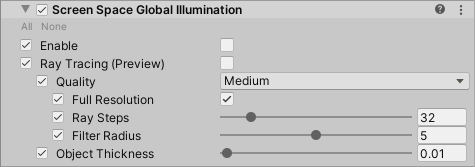

# Screen Space Global Illumination (Preview)

The **Screen Space Illumination** (SSGI) override is a High Definition Render Pipeline (HDRP) feature that uses the depth and color buffer of the screen to calculate diffuse light bounces.

HDRP implements [ray-traced global illumination](Ray-Traced-Global-Illumination.md) on top of this override. This means that the properties visible in the Inspector change depending on whether or not you enable ray tracing. 

## Enabling Screen Space Global Illumination
[!include]

For this feature:
The property to enable in your HDRP Asset is: **Lighting > Screen Space Global Illumination**.
The property to enable in your Frame Settings is: **Lighting > Screen Space Global Illumination**.

## Using Screen Space Global Illumination

HDRP uses the [Volume](Volumes.md) framework to calculate SSGI, so to enable and modify SSGI properties, you must add a **Screen Space Global Illumination** override to a [Volume](Volumes.md) in your Scene. To add **Screen Space Global Illumination** to a Volume:

1. In the Scene or Hierarchy view, select a GameObject that contains a Volume component to view it in the Inspector.
2. In the Inspector, navigate to **Add Override > Lighting** and click **Screen Space Global Illumination**. 
   HDRP now calculates SSGI for any Camera this Volume affects.

## Properties

[!include]

The properties visible in the Inspector change depending on whether or not you enable ray tracing for this effect:

- To not use ray tracing and instead use the screen-space global illumination solution, disable **Ray Tracing** in the Inspector and see [Screen-space](#screen-space) for the list of properties.

- To use ray tracing, enable **Ray Tracing** in the Inspector and see [Ray-traced](#ray-traced) for the list of properties.

### Screen-space

| **Property**         | **Description**                                              |
| -------------------- | ------------------------------------------------------------ |
| **Enable**           | Indicates whether HDRP processes SSGI for Cameras in the influence of this effect's Volume. |
| **Ray Tracing**      | Indicates whether HDRP uses ray tracing to calculate global illumination. If you enable this property, it completely changes the implementation for this Volume override and exposes a new set of properties to control the ray-traced global illumination. For information on ray-traced global illumination, see [ray-traced global illumination](Ray-Traced-Global-Illumination.md). For information on the properties that control the ray-traced global illumination, see the [Ray-traced](#ray-traced) properties section below. |
| **Quality**          | Specifies the overall quality of the effect. The higher the quality, the more resource-intensive the effect is to process. |
| **Full Resolution**  | Toggles whether HDRP calculates SSGI at full resolution.     |
| **Ray Steps**        | The number of ray steps to use to calculate SSGI. If you set this to a higher value, the quality of the effect improves, however it is more resource intensive to process. |
| **Filter Radius**    | The size of the filter use to smooth the effect after raymarching. Higher value mean blurrier result and is more resource intensive. |
| **Object Thickness** | Use the slider to control the thickness of the GameObjects on screen. Because the SSR algorithm can not distinguish thin GameObjects from thick ones, this property helps trace rays behind GameObjects. The algorithm applies this property to every GameObject uniformly. |

### Ray-traced

| Property                       | Description                                                  |
| ------------------------------ | ------------------------------------------------------------ |
| **Ray Tracing**                | Enable this to make HDRP use ray tracing to evaluate indirect diffuse lighting. This makes extra properties available that you can use to adjust the quality of Ray-Traced Global Illumination. |
| **LayerMask**                  | Defines the layers that HDRP processes this ray-traced effect for. |
| **Mode**                       | Defines if HDRP should evaluate the effect in **Performance** or **Quality** mode. This property only appears if you select set **Supported Ray Tracing Mode** in your HDRP Asset to **Both**. |
| **Quality**                    | Specifies the preset HDRP uses to populate the values of the following nested properties. The options are: &#8226; **Low**: A preset that emphasizes performance over quality. &#8226; **Medium**: A preset that balances performance and quality. &#8226; **High**: A preset that emphasizes quality over performance. &#8226; **Custom**: Allows you to override each property individually. This property only appears if you set **Mode** to **Performance**. |
| **Max Ray Length**             | Controls the maximal length of rays. The higher this value is, the more resource-intensive ray traced global illumination is. |
| **Clamp Value**                | Set a value to control the threshold that HDRP uses to clamp the pre-exposed value. This reduces the range of values and makes the global illumination more stable to denoise, but reduces quality. |
| **Full Resolution**            | Enable this feature to increase the ray budget to one ray per pixel, per frame. Disable this feature to decrease the ray budget to one ray per four pixels, per frame. This property only appears if you set **Mode** to **Performance**. |
| **Upscale Radius**             | Controls the radius of the up-scaler that HDRP uses to build the GI. The larger the radius, the more neighbors HDRP uses to build the GI, the better the quality. This property only appears if you set **Mode** to **Performance**. |
| **Sample Count**               | Controls the number of rays per pixel per frame. Increasing this value increases execution time linearly. This property only appears if you set **Mode** to **Quality**. |
| **Bounce Count**               | Controls the number of bounces that global illumination rays can do. Increasing this value increases execution time exponentially. This property only appears if you set **Mode** to **Quality**. |
| **Denoise**                    | Enable this to enable the spatio-temporal filter that HDRP uses to remove noise from the Ray-Traced global illumination. |
| - **Half Resolution Denoiser** | Enable this feature to evaluate the spatio-temporal filter in half resolution. This decreases the resource intensity of denoising but reduces quality. |
| - **Denoiser Radius**          | Set the radius of the spatio-temporal filter.                |
| - **Second Denoiser Pass**     | Enable this feature to process a second denoiser pass. This helps to remove noise from the effect. |

## Limitations

### Ray-traced global illumination

Currently, ray tracing in HDRP does not support [decals](decal.md). This means that ray-traced global illumination does not affect decals in your Scene.