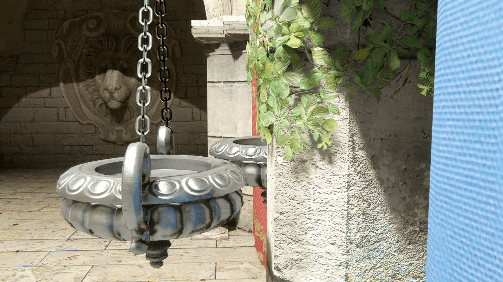
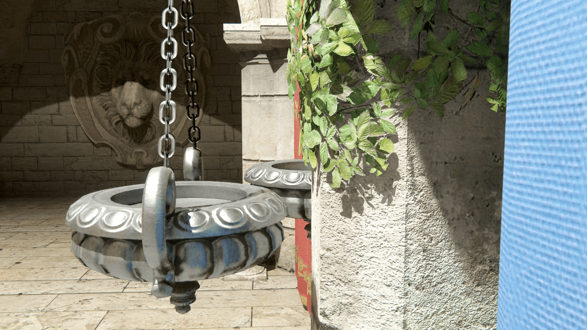

# Ray-Traced Contact Shadows

Ray-Traced Contact Shadows is a ray tracing feature in the High Definition Render Pipeline (HDRP). It is an alternative to HDRP's [Contact Shadow](Override-Contact-Shadows.md) technique that uses a more accurate ray-traced solution that can use off-screen data.

**Without Contact shadows**

**Contact shadows**

**Ray-traced contact shadows**

For information about ray tracing in HDRP, and how to set up your HDRP Project to support ray tracing, see [Getting started with ray tracing](Ray-Tracing-Getting-Started.md).

## Using Ray-Traced Contact Shadows

Because this feature is an alternative to the [Contact Shadows](Override-Contact-Shadows.md) Volume override, the initial setup is very similar. To setup ray-traced contact shadows, first follow the [Enabling Contact Shadows](Override-Contact-Shadows.md#enabling-contact-shadows) and [Using Contact Shadows](Override-Contact-Shadows.md#using-contact-shadows) steps. After you setup the Contact Shadows override, to make it use ray tracing:

1. In the Frame Settings for your Cameras, enable **Ray Tracing**.
2. HDRP calculates ray-traced contact shadows on a per-light basis. This means you need to enable it for each light.
3. Select a [Light](Light-Component.md) and, in the Inspector, go to **Shadows > Contact Shadows** and tick the **Enable** checkbox. This exposes the **Ray Tracing** property.
4. Enable the **Ray Tracing** checkbox.

