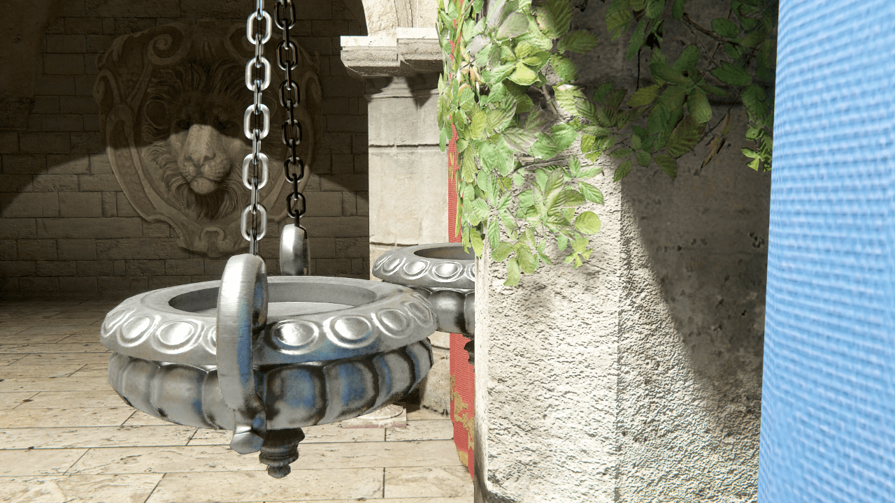

# Ray-Traced Contact Shadows

Ray-Traced Contact Shadows is a ray tracing feature in the High Definition Render Pipeline (HDRP). It is an alternative to HDRP's [Contact Shadow](Override-Contact-Shadows.html) technique that uses a more accurate ray-traced solution that can use off-screen data.

**Contact shadows**

**Ray-traced contact shadows**

For information about ray tracing in HDRP, and how to set up your HDRP Project to support ray tracing, see [Getting started with ray tracing](Ray-Tracing-Getting-Started.html).

## Using Ray-Traced Contact Shadows

Because this feature is an alternative to the [contact shadows](Override-Contact-Shadows.html) Volume Override, the initial setup is very similar. 

1. Enable contact shadows in your [HDRP Asset](HDRP-Asset.html).
2. Enable contact shadows for your Cameras.
3. Add the effect to a [Volume](Volumes.html) in your Scene.

### HDRP Asset setup

The [HDRP Asset](HDRP-Asset.html) controls which features are available in your HDRP Project. To make HDRP support and allocate memory for contact Shadows:

1. Click on your HDRP Asset in the Project window to view it in the Inspector.
2. In the **Lighting > Shadows** section, enable **Contact Shadows**.

### Camera setup

Cameras use [Frame Settings](Frame-Settings.html) to decide how to render the Scene. To enable contact shadows for your Cameras by default:

1. Open the Project Settings window (menu: **Edit > Project Settings**), then select the HDRP Default Settings tab.
2. Select **Camera** from the **Default Frame Settings For** drop-down.
3. In the **Lighting** section, enable **Contact Shadows**.

All Cameras can now process contact shadows unless they use custom [Frame Settings](Frame-Settings.html). If they do:

1. In the Scene view or Hierarchy, select the Camera's GameObject to open it in the Inspector.
2. In the **Custom Frame Settings**, navigate to the **Lighting** section and enable **Contact Shadows**.

### Volume setup

Ray-Traced Contact Shadow uses the [Volume](Volumes.html) framework, so to enable this feature and modify its properties, you need to add an Contact Shadow override to a [Volume](Volumes.html) in your Scene. To do this:

1. In the Scene or Hierarchy view, select a GameObject that contains a Volume component to view it in the Inspector.
2. In the Inspector, navigate to **Add Override > Lighting** and click on Conact Shadows. HDRP now applies contact shadow to any Camera this Volume affects.

### Light Setup

To make HDRP calculate, and use, Ray-Traced Contact Shadows, you need to enable them on a Light .

1. In your Light component, go to **Shadows > Contact Shadows** and tick the **Enable** checkbox. This exposes the **Ray Tracing** property.
2. Enable the **Ray Tracing** checkbox.

