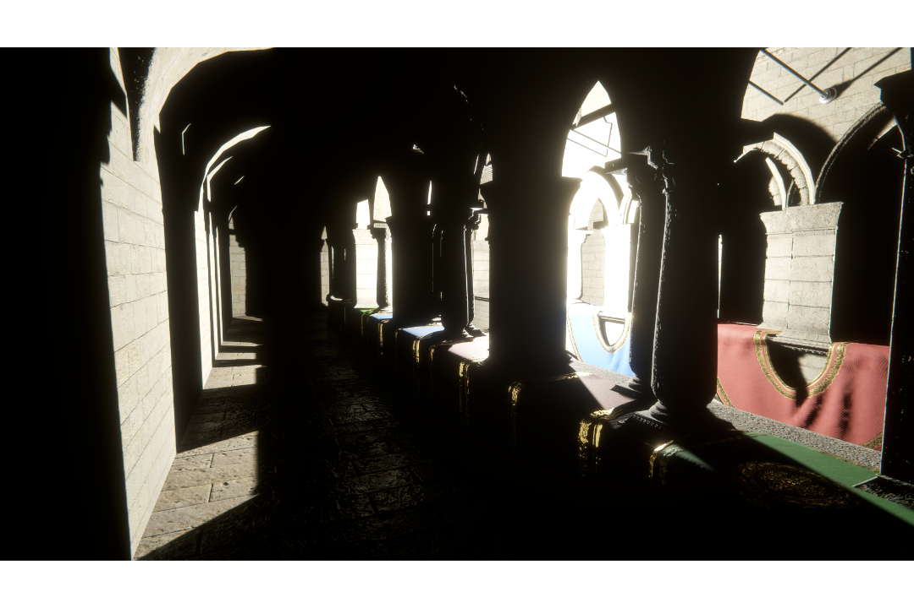
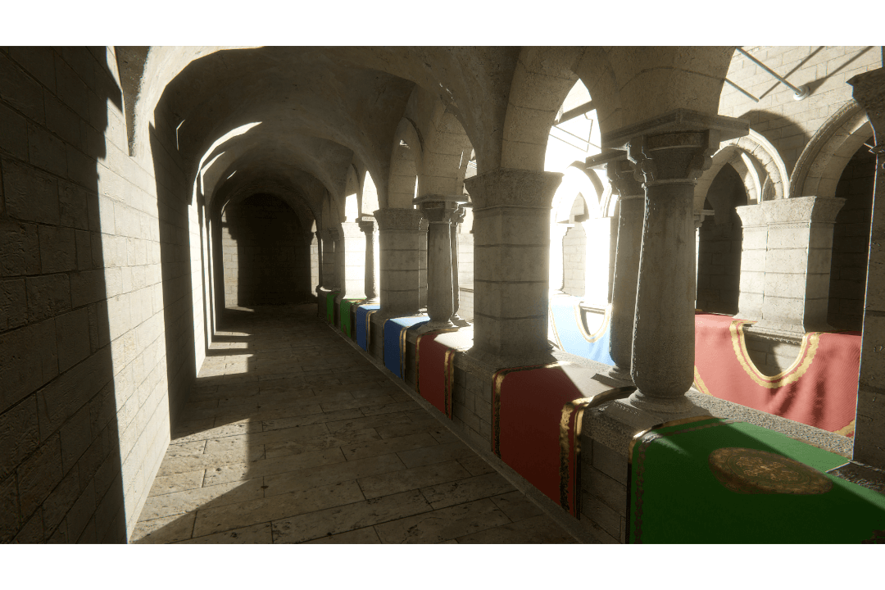
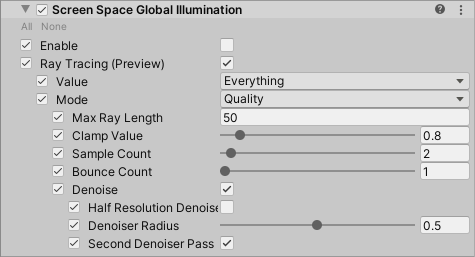

# Ray Traced Global Illumination

Ray Traced Global Illumination is a ray tracing feature in the High Definition Render Pipeline (HDRP) that is an alternative to Light Probes and lightmaps.

Ray Traced Global Illumination off

Ray Traced Global Illumination on

## Using Ray Traced Global Illumination

Ray Traced Global Illumination uses the [Volume](Volumes.html) framework, so to enable this feature, and modify its properties, you need to add a Global Illumination override to a [Volume](Volumes.html) in your Scene. To do this:

1. In the Scene or Hierarchy view, select a GameObject that contains a Volume component to view it in the Inspector.
2. In the Inspector, navigate to Add Override > Ray Tracing and click on Global Illumination.
3. In the Inspector for the Global Illumination Volume Override, enable Ray Tracing. HDRP now uses ray tracing to calculate reflections. If you do not see the Ray Tracing option, make sure your HDRP Project supports ray tracing. For information on setting up ray tracing in HDRP, see [getting started with ray tracing](Ray-Tracing-Getting-Started.html).

## Properties

Alongside the standard properties, Unity exposes different properties depending on the ray tracing tier your HDRP Project is using. For information on what each tier does, and how to select a tier for your HDRP Project, see [gettings started with ray tracing](Ray-Tracing-Getting-Started.html#TierTable).

### Shared

| Property                       | Description                                                  |
| ------------------------------ | ------------------------------------------------------------ |
| **Ray Tracing**                | Makes HDRP use ray tracing to evaluate indirect diffuse lighting. Enabling this exposes properties that you can use to adjust the quality of ray traced global illumination. |
| **Ray Length**                 | Controls the length of the rays that HDRP uses for ray tracing. If a ray doesn't find an intersection, then the ray returns the color of the sky. |
| **Clamp Value**                | Controls the threshold that HDRP uses to clamp the pre-exposed value. This reduces the range of values and makes the global illumination more stable to denoise, but reduces quality. |
| **Denoise**                    | Enables the spatio-temporal filter that HDRP uses to remove noise from the ray traced global illumination. |
| - **Half Resolution Denoiser** | Enable this feature to evaluate the spatio-temporal filter in half resolution. This decreases the resource intensity of denoising but reduces quality. |
| - **Denoiser Radius**          | Controls the radius of the spatio-temporal filter.           |
| - **Second Denoiser Pass**     | Enable this features to process a second denoiser pass.      |
| - **Second Denoiser Radius**   | Controls the radius of the spatio-temporal filter for the second denoiser pass. |

### Tier 1

| Property          | Description                                                  |
| ----------------- | ------------------------------------------------------------ |
| **Deferred Mode** | Enable this feature to make HDRP evaluate this as a deferred effect. This significantly improves performance, but can reduce the visual fidelity. |
| **Ray Binning**   | Enable this feature to "sort" rays to make them more coherent and reduce the resource intensity of this effect. |

### Tier 2

| Property         | Description                                                  |
| ---------------- | ------------------------------------------------------------ |
| **Sample Count** | Controls the number of rays per pixel per frame. Increasing this value increases execution time linearly. |
| **Bounce Count** | Controls the number of bounces that global illumination rays can do. Increasing this value increases execution time exponentially. |
