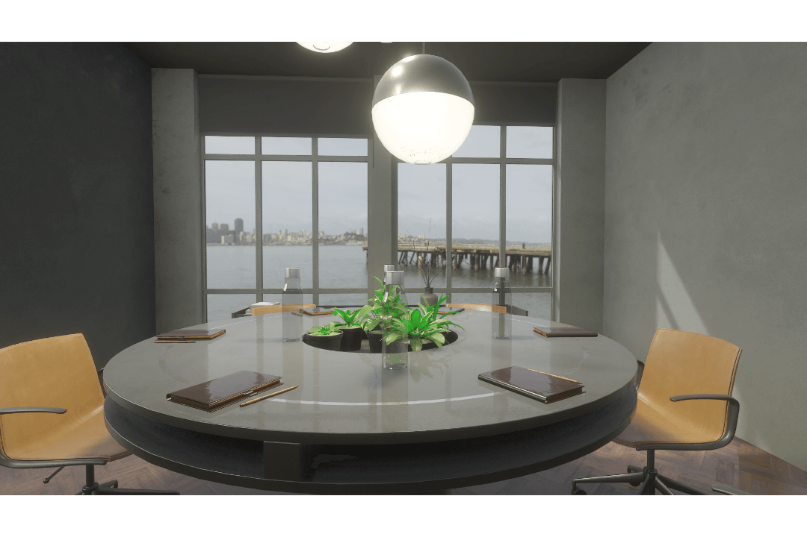
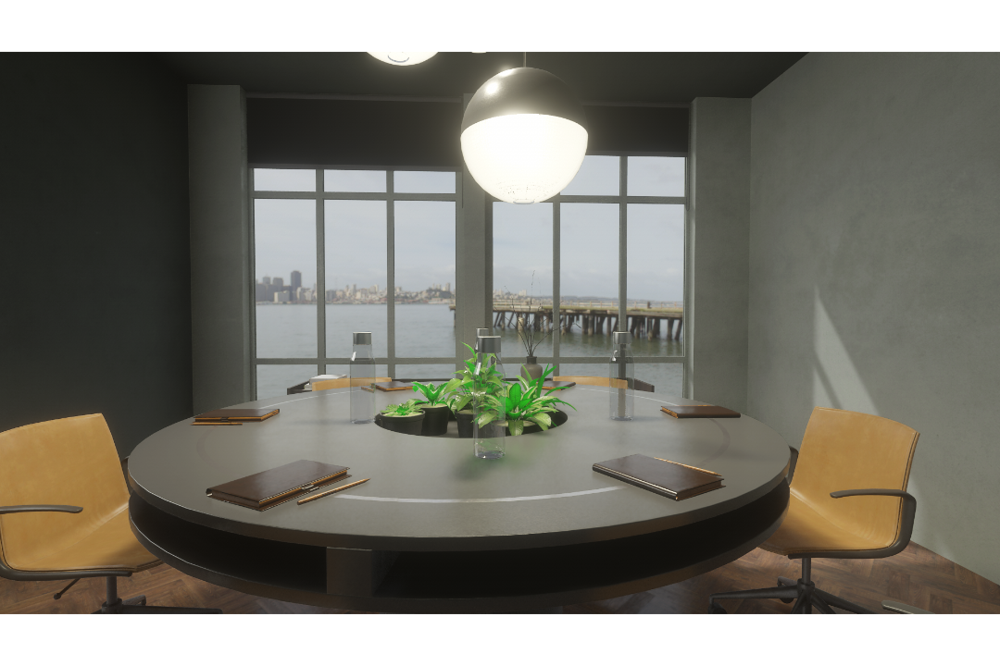
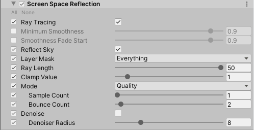

# Ray-Traced Reflections

Ray-Traced Reflections is a ray tracing feature in the High Definition Render Pipeline (HDRP). It is an alternative, more accurate, ray-traced solution to [Screen Space Reflection](Override-Screen-Space-Reflection.html) that can make use of off screen data.

**Screen-space reflections**

**Ray-traced reflections**

For information about ray tracing in HDRP, and how to set up your HDRP Project to support ray tracing, see [Getting started with ray tracing](Ray-Tracing-Getting-Started.html).

## Using Ray-Traced Reflections

Because this feature replaces the [Screen Space Reflection](Override-Screen-Space-Reflection.html) Volume Override, the initial setup is very similar.

1. Enable screen space reflection in your [HDRP Asset](HDRP-Asset.html).
2. In the Frame Settings for your Cameras, enable Screen Space Reflection.
3. In the Frame Settings for your Cameras, enable Ray Tracing.
4. Add the effect to a [Volume](Volumes.html) in your Scene.

### HDRP Asset setup

1. Click on your HDRP Asset in the Project window to view it in the Inspector.
2. In the Lighting section, enable Screen Space Reflection.

### Camera setup

Cameras use [Frame Settings](Frame-Settings.html) to decide how to render the Scene. To enable screen space reflection for your Cameras by default:

1. Open the Project Settings window (menu: **Edit > Project Settings**), then select the HDRP Default Settings tab.
2. Select Camera from the Default Frame Settings For drop-down.
3. In the Lighting section, enable Screen Space Reflection.
4. In the Rendering section, enable Ray Tracing.

All Cameras can now process screen space reflection unless they use custom [Frame Settings](Frame-Settings.html). If they do:

1. In the Scene view or Hierarchy, select the Camera's GameObject to open it in the Inspector.
2. In the Custom Frame Settings, navigate to the Lighting section and enable Screen Space Reflection.
3. In the Custom Frame Settings, navigate to the Rendering section and enable Ray Tracing.

### Volume setup

Ray-Traced Reflections uses the [Volume](Volumes.html) framework, so to enable this feature, and modify its properties, you need to add a Screen Space Reflection override to a [Volume](Volumes.html) in your Scene. To do this:

1. In the Scene or Hierarchy view, select a GameObject that contains a Volume component to view it in the Inspector.
2. In the Inspector, navigate to ****Add Override > Lighting**** and click on Screen Space Reflection. HDRP now applies screen space reflection to any Camera this Volume affects.
3. In the Inspector for the Screen Space Reflection Volume Override, enable Ray Tracing. HDRP now uses ray tracing to calculate reflections. If you do not see the Ray Tracing option, make sure your HDRP Project supports ray tracing. For information on setting up ray tracing in HDRP, see [Getting started with ray tracing](Ray-Tracing-Getting-Started.html).

## Properties

Alongside the standard properties, Unity exposes extra properties depending on the ray tracing mode you are using.

### Shared

| Property                  | Description                                                  |
| ------------------------- | ------------------------------------------------------------ |
| **Ray Tracing**           | Makes HDRP use ray tracing to process screen-space reflections. Enabling this exposes properties that you can use to adjust the quality of ray-traced reflections. |
| **Minimum Smoothness**    | Controls the minimum smoothness value for a pixel at which HDRP processes ray-traced reflections. If the smoothness value of the pixel is lower than this value, HDRP falls back to the next available reflection method in the [reflection hierarchy](Reflection-in-HDRP.html#ReflectionHierarchy). |
| **Smoothness Fade Start** | Controls the smoothness value at which the smoothness controlled fade out starts. The fade is in the range [Min Smoothness, Smoothness Fade Start]. |
| **Reflect Sky**           | Enable this feature to specify to HDRP that it should use the sky as a fall-back for ray-traced reflections when a ray doesn't find an intersection. |
| **LayerMask**             | Defines the layers that HDRP processes this ray-traced effect for. |
| **Ray Length**            | Controls the length of the rays that HDRP uses for ray tracing. If a ray doesn't find an intersection, then the ray returns the color of the sky if Reflect Sky is enabled, or black if not. |
| **Clamp Value**           | Controls the threshold that HDRP uses to clamp the pre-exposed value. This reduces the range of values and makes the reflections more stable to denoise, but reduces quality. |
| **Denoise**               | Enables the spatio-temporal filter that HDRP uses to remove noise from the reflections. |
| - **Denoiser Radius**     | Controls the radius of the spatio-temporal filter. Increasing this value results in a more blurry result and a higher execution time. |

### Performance Mode

| Property            | Description                                                  |
| ------------------- | ------------------------------------------------------------ |
| **Upscale Radius**  | Controls the radius of the up-scaler that HDRP uses to build the reflection. The larger the radius, the more neighbors HDRP uses to build the reflection, the better the quality. |
| **Full Resolution** | Enable this feature to increase the ray budget to one ray per pixel, per frame. Disable this feature to decrease the ray budget to one ray per four pixels, per frame. |

### Quality Mode

When using quality mode, there are extra properties that you can use to customize the quality of this effect.

| Property         | Description                                                  |
| ---------------- | ------------------------------------------------------------ |
| **Sample Count** | Controls the number of rays per pixel per frame. Increasing this value increases execution time linearly. |
| **Bounce Count** | Controls the number of bounces that reflection rays can do. Increasing this value increases execution time exponentially. |