# Ray-traced shadows

Ray-traced shadows are shadows that HDRP generates by tracing rays of light from the following [Light](Light-Component.html) sources:

- [Directional](#DirectionalLight)
- [Point](#PointLight)
- [Spot](#SpotLight)
- [Rectangle](#RectangleLight)

When you enable ray-traced shadows in your HDRP Project, they replace shadow maps for opaque GameObjects.

## Using ray-traced shadows

All ray-traced shadows are screen space shadows. This means that HDRP stores them in a screen space buffer which holds the information for every pixel on the screen that is in the depth buffer (which only stores opaque GameObjects).

To use ray-traced shadows, enable screen space shadows in your HDRP Project. To do this:

1. Click on your HDRP Asset in the Project window to view it in the Inspector.
2. In the Lighting section, enable Screen Space Shadows.
3. Set the value for Maximum to be the maximum number of screen space shadows you want to evaluate each frame. If there are more than this number of Lights in your Scene then HDRP only ray casts the shadows for this number of them, then uses a shadow map for the rest.

Then make sure you enable Screen Space Shadows for your Cameras. To do this:

1. Open the Project Settings window (menu: **Edit > Project Settings**), then select the HDRP Default Settings tab.
2. Select Camera from the Default Frame Settings For drop-down.
3. In the Lighting section, enable Screen Space Shadows.

Finally, to make HDRP process ray-traced shadows for your Directional, Point, or Rectangle Light:

1. Under the Shadow Map fold-out in the Shadows section, click the Enable checkbox.
2. Also in the Shadow Map foldout, enable Ray-Traced Shadows. For Directional Lights, you need to enable Screen Space Shadows to access this property.
3. To change the behavior of the shadows, edit the properties under Ray-Traced Shadows.

## Directional Light

Ray-traced shadows offer an alternative to the cascade shadow map that Directional Lights use for opaque GameObjects.

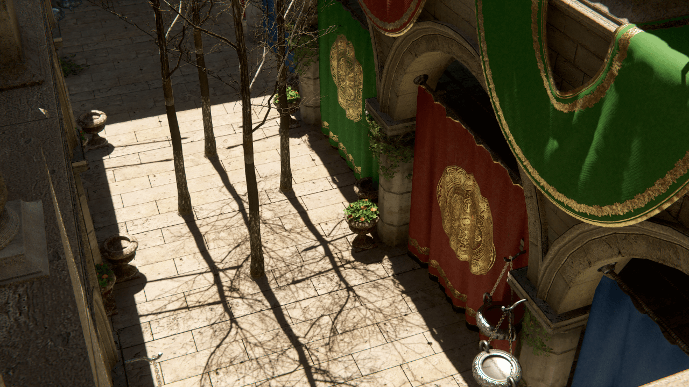

**Directional Light cascade shadow map**

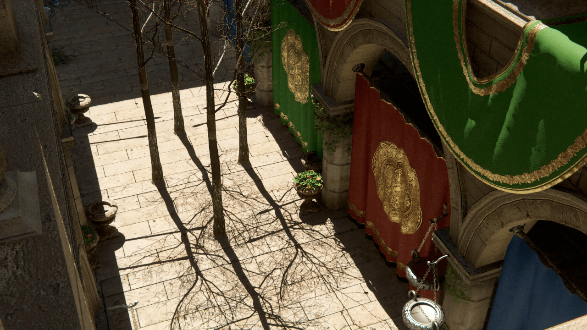

**Ray-traced Directional Light shadows (Sun Angle = 0)**

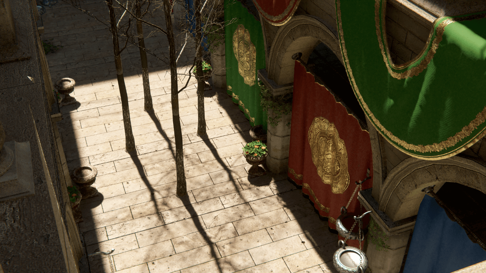

**Ray-traced Directional Light shadows (Sun Angle = 0.53, the angle of the Sun as seen from Earth)**

Ray-traced shadows allow for transparent and transmissive GameObjects, lit by Directional Lights, to cast colored shadows.

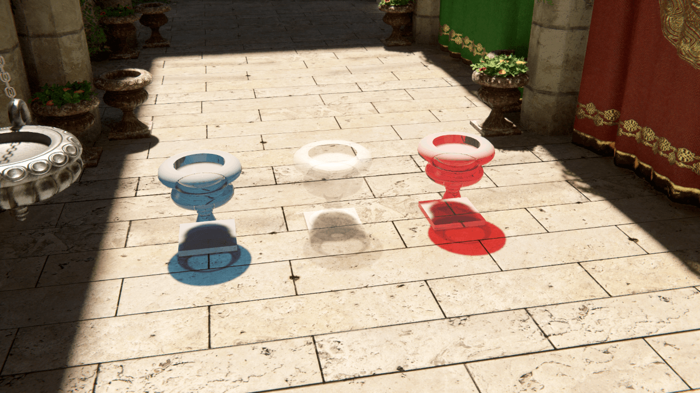

**Ray-traced Directional Light shadows with colored shadows**

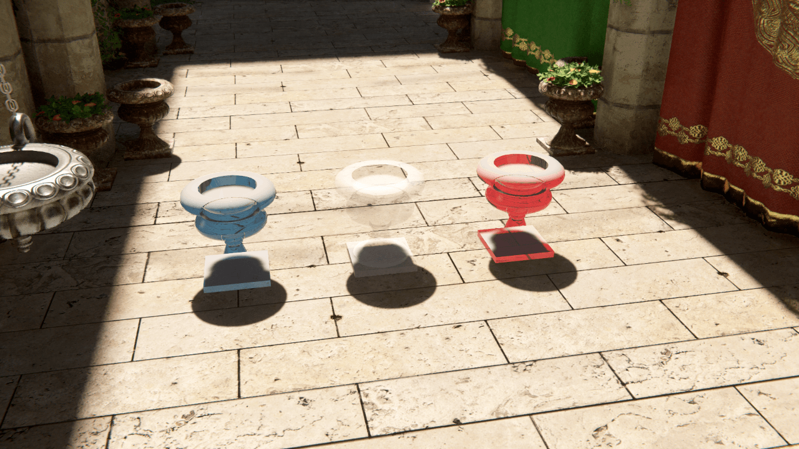

**Ray-traced Directional Light shadows without colored shadows**

### Properties

| Property              | Description                                                  |
| --------------------- | ------------------------------------------------------------ |
| **Sun Angle**         | Sets the size of the Sun in the sky, in degrees. For example, the value for the Sun on Earth is 0.53°. |
| **Sample Count**      | Controls the number of rays that HDRP uses per pixel, per frame. Higher values produce more accurate shadows. Increasing this value increases execution time linearly. |
| **Color Shadow**      | Allows transparent and transmissive GameObjects to cast colored shadows. |
| **Denoise**           | Enables the spatio-temporal filter that HDRP uses to remove noise from the ray-traced shadows; making them smoother. |
| - **Denoiser Radius** | Controls the radius of the spatio-temporal filter.           |

## Point And Spot Light

Ray-traced shadows offer an alternative to the shadow map that Point and Spot Lights use for opaque GameObjects. HDRP still evaluates the lighting of a Point Light as coming from a single point in space (the light is [punctual](Glossary.md#punctual-lights)), but it evaluates the shadowing as if the light was coming from the surface of a sphere. On the other side, HDRP evaluates the lighting of a Spot Light as coming from a single point in space, but it evaluates the shadowing as if the light was coming from the surface of a cone.

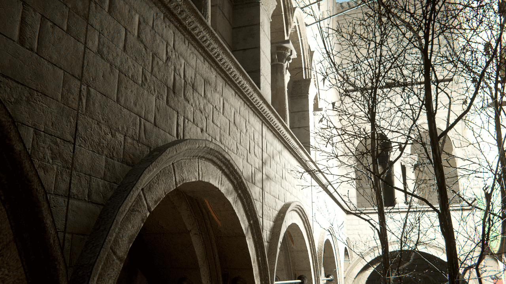

**Point Light shadow map**

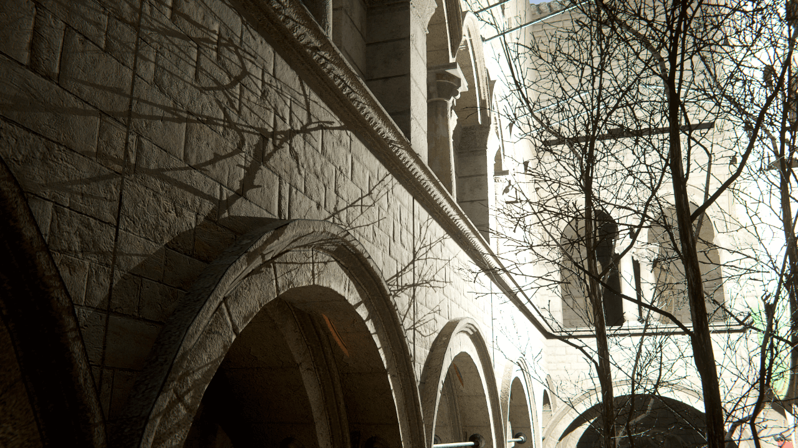

**Ray-traced Point Light shadows (Radius = 0.001m)**

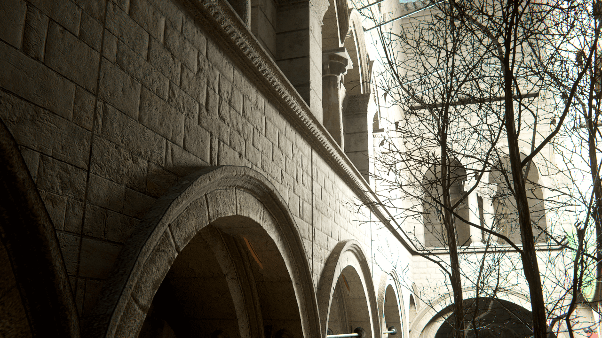

**Ray-traced Point Light shadows (radius = 0.5m)**

Ray-traced shadows offer the possibility of semi-transparent shadows for Point Lights cast by tranparent and transmissive GameObjects.

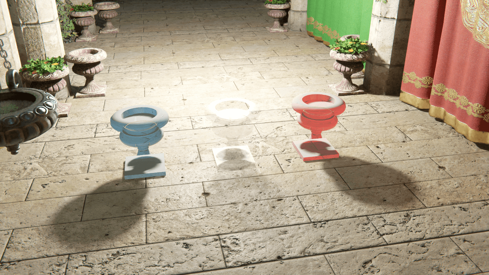

**Ray-traced Point Light shadows with semi-transparent shadows**

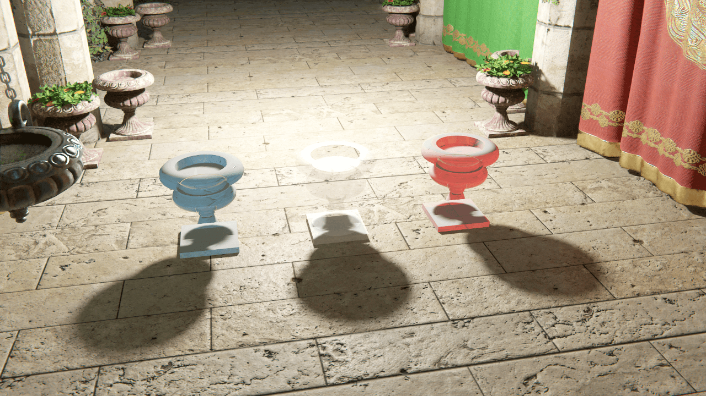

**Ray-traced Point Light shadows without semi-transparent shadows**

### Properties

| Property              | Description                                                  |
| --------------------- | ------------------------------------------------------------ |
| **Sample Count**      | Controls the number of rays that HDRP uses per pixel, per frame. A low number of samples produces a noisier image that requires more denoising. Increasing this value increases execution time linearly. |
| **Semi-Transparent Shadow**      | Allows transparent and transmissive GameObjects to cast semi-transparent shadows. |
| **Radius**            | Sets the radius of the sphere light that HDRP uses to evaluate the shadows. This increases the size of the surface that emits light. |
| **Denoise**           | Enables the spatio-temporal filter that HDRP uses to remove noise from the ray-traced shadows. |
| - **Denoiser Radius** | Controls the radius of the spatio-temporal filter.           |

## Rectangle Light

Ray-traced shadows offer an alternative to the [exponential variance shadow map](Glossary.html#ExponentialVarianceShadowMap) that Rectangle Lights use for opaque GameObjects.

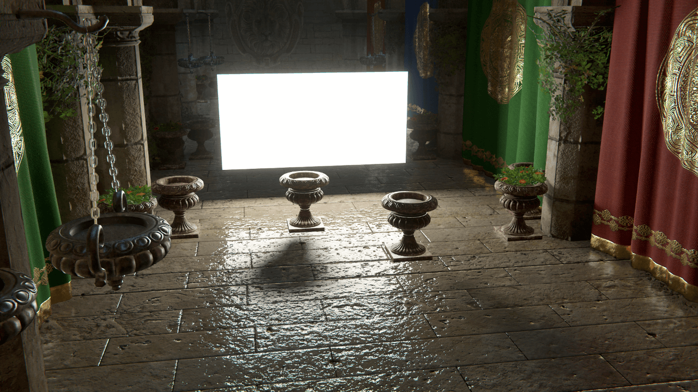

**Rectangle Light shadow map**

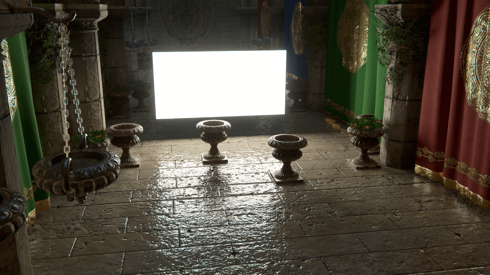
**Ray-traced Rectangle Light shadows**

### Properties

| Property              | Description                                                  |
| --------------------- | ------------------------------------------------------------ |
| **Sample Count**      | Controls the number of rays that HDRP uses per pixel, per frame. Increasing this values increases execution time linearly. |
| **Denoise**           | Enables the spatio-temporal filter that HDRP uses to remove noise from the ray-traced shadows. |
| - **Denoiser Radius** | Controls the radius of the spatio-temporal filter.           |
