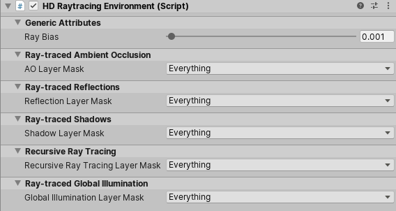

# Ray Tracing Environment

This component allows you to use ray tracing in your Scene. It defines which Layers use ray tracing effects, as well as a bias . If your Scene does not contain this component, then you can not use ray tracing.

## Using the Ray Tracing Environment

To add a Ray Tracing Environment to your Scene, you can:

- Add the component to a GameObject already in your Scene.

- 1. In the Scene view or Hierarchy, select a GameObject.
  2. Select Add Component > Scripts > Unity.Rendering.HighDefinition > HD Raytracing Environment.

- Create a new GameObject with the component already attached.

- 1. Select GameObject > Rendering > Ray Tracing Environment.

## Properties

The LayerMasks define which GameObjects to include in the  Note that every new layer combination triggers the build of a different ray tracing acceleration structure which will increase the execution time.

| Property                       | Description                                                  |
| ------------------------------ | ------------------------------------------------------------ |
| Ray Bias                       | Specifies a bias that HDRP adds to the ray origin position along the surface normal. |
| Ray Traced Ambient Occlusion   | Defines the Layers that HDRP processes [ray traced ambient occlusion](Ray-Traced-Ambient-Occlusion.html) for. |
| Ray Traced Reflections         | Defines the Layers that HDRP processes [ray traced reflections](Ray-Traced-Reflections.html) for. |
| Ray Traced Shadows             | Defines the Layers that HDRP processes [ray traced shadows](Ray-Traced-Shadows.html) for. |
| Recursive Ray Tracing          | Defines the Layers that HDRP processes [recursive rendering](Ray-Tracing-Recursive-Rendering.html) for. |
| Ray Traced Global Illumination | Defines the Layers that HDRP processes [ray traced global illumination](Ray-Traced-Global-Illumination.html) for. |