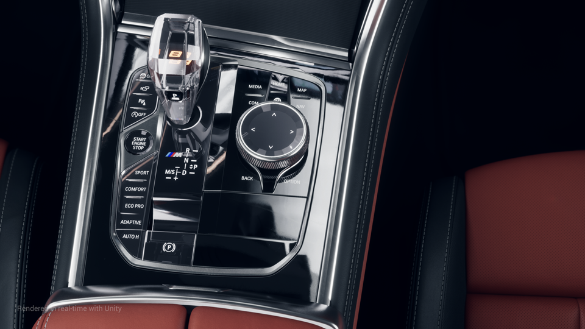

# Recursive rendering

This feature is a replacement pipeline for rendering Meshes in the High Definition Render Pipeline (HDRP). GameObjects that use this rendering mode cast refraction and reflection rays recursively. However, every ray that reflects or refracts does not deviate depending on the smoothness of the Material. This makes this rendering mode useful for rendering multi-layered transparent GameObjects.

Car gear shift rendered with recursive ray tracing

## Using Recursive rendering

Recursive Rendering uses the [Volume](Volumes.html) framework, so to enable this feature, and modify its properties, you need to add a Recursive Rendering override to a [Volume](Volumes.html) in your Scene. To do this:

1. In the Scene or Hierarchy view, select a GameObject that contains a Volume component to view it in the Inspector.
2. In the Inspector, navigate to Add Override > Ray Tracing and click on Recursive Rendering.
3. In the Inspector for the Recursive Rendering Volume Override, enable Ray Tracing. If you do not see the Ray Tracing option, make sure your HDRP Project supports ray tracing. For information on setting up ray tracing in HDRP, see [getting started with ray tracing](Ray-Tracing-Getting-Started.html).

Now that you have recursive rendering set up in your Scene, you must set GameObjects to use the Raytracing rendering pass to make HDRP use recursive rendering for them. To do this:

1. Select the GameObject in the Scene view or Hierarchy to view it in the Inspector.
2. Select the Material attached to the GameObject.
3. In the Surface Options foldout, select Raytracing from the Rendering Pass drop-down.

You can also do this for Shader Graph master nodes:

1. In the Project window, double-click on the Shader to open it in Shader Graph.
2. On the master node, click the cog, then select Raytracing from the Rendering Pass drop-down.

## Properties

| Property       | Description                                                  |
| -------------- | ------------------------------------------------------------ |
| **Max Depth**  | Controls the number of bounces that rays can do. Increasing this value increases execution time exponentially. |
| **Ray Length** | Controls the length of the rays that HDRP uses for ray tracing. If a ray doesn't find an intersection, then the ray returns the color of the sky. |