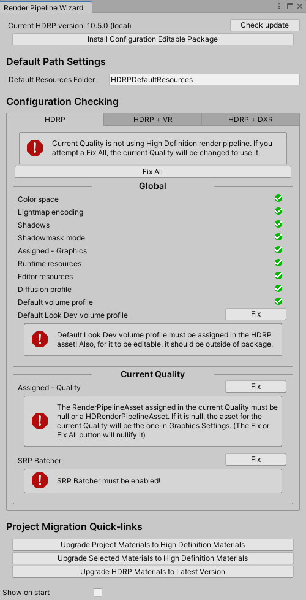

# Render Pipeline Wizard

The High Definition Render Pipeline (HDRP) includes the **Render Pipeline Wizard** to help you configure your Unity Project so that it is compatible with HDRP. 

To open the **Render Pipeline Wizard**, go to **Window > Analysis** and select **Render Pipeline Wizard**.

## Contents

| **Property**                 | **Description**                                              |
| ---------------------------- | ------------------------------------------------------------ |
| **Default Resources Folder** | Set the folder name that the Render Pipeline Wizard uses when it loads or creates resources. Click the **Populate / Reset** button to populate the **Default Resources Folder** with the resources that HDRP needs to render a Scene (for details, see [Populating the default resources folder](#PopulatingFolder)). If a default Asset already exists in the folder then clicking the Populate/Reset button resets the existing Asset. |
| **Default Scene Prefab**     | Set the default Prefab that Unity needs to instantiate in a new Scene when you select **File > New Scene**. To instantly create a Scene Asset with this template, go to **Assets > Create** and click **HD Template Scene**. |

## HDRP configuration checker

Your Unity Project must adhere to all the configuration tests in this section for HDRP to work correctly. If a test fails, a message explains the issue and you can click a button to fix it. This helps you quickly fix any major issues with your HDRP Project. The Render Pipeline Wizard can load or create any resources that are missing by placing new resources in the **Default Resources Folder**.

| **Configuration**          | **Description**                                              |
| -------------------------- | ------------------------------------------------------------ |
| **Script Runtime Version** | Checks to make sure the C# script runtime version supports HDRP (.Net 4 or higher).Click the **Fix** button to set the script runtime version to a version that supports HDRP. **Note**: If the script runtime version does not support HDRP, HDRP can not compile the Project, which means that you can not launch the Render Pipeline Wizard. However, if HDRP has previously compiled the Project and an update changes the script runtime version, the Render Pipeline Wizard can detect this and change the script runtime version to a compatible version. |
| **Color Space**            | Checks to make sure **Color Space** is set to **Linear**. HDRP only supports **Linear Color Space** because it gives more physically accurate results than **Gamma**.Press the **Fix** button to set the **Color Space** to **Linear.** |
| **Lightmap Encoding**      | Check to make sure **Lightmap Encoding** is set to **High Quality**, which is the only mode that HDRP supports. Press the **Fix** button to make Unity encode lightmaps in **High Quality** mode. This fixes lightmaps for all platforms. |
| **Shadows**                | Checks to make sure **Shadow Quality** is set to **All**. Unity hides this option when you install HDRP, and automatically sets it to **All**.Press the **Fix** button to set **Shadow Quality** to **All**. |
| **Shadowmask Mode**        | Checks to make sure **Shadowmask Mode** is set to **Distance Shadowmask** at the Project level. This allows you to change the **Shadowmask Mode** on a per-[Light](Light-Component.html) level.Press the **Fix** button to set the **Shadowmask Mode** to **Distance Shadowmask**. |
| **Asset Configuration**    | Checks every configuration in this section.Press the **Fix All** button to fix every configuration in this section. |
| **- Assigned**             | Checks to make sure you have assigned an [HDRP Asset](HDRP-Asset.html) to the **Scriptable Render Pipeline Settings** field (menu: **Edit** > **Project Settings** > **Graphics**).Press the **Fix** button to open a pop-up that allows you to either assign an HDRP Asset or create and assign a new one. |
| **- Runtime Resources**    | Checks to make sure that your HDRP Asset references a [**Render Pipeline Resources**](HDRP-Asset.html#GeneralProperties) Asset.Press the **Fix** button to reload the runtime resources for the HDRP Asset. |
| **- Editor Resources**     | Checks to make sure that your HDRP Asset references a [**Render Pipeline Editor Resources**](HDRP-Asset.html#GeneralProperties)  Asset.Press the **Fix** button to reload the runtime resources for the HDRP Asset. |
| **- Diffusion Profile**    | Checks to make sure that your HDRP Asset references a [**Diffusion Profile**](Diffusion-Profile.html) Asset.Press the **Fix** button to reload the runtime resources for the HDRP Asset. |
| **Default Scene Prefab**   | Checks to make sure you have assigned something to **Default Scene Prefab** in this wizard.Press the **Fix** button to open a pop-up that allows you to either assign a Prefab or create and assign a new one. |

 

### Populating the default resources folder

When you click **Populate/Reset**, HDRP generates the following Assets:

- **DefaultSceneRoot**: The Prefab that Unity instantiates in each new HDRP template Scene.
- **DefautRenderingSettings**: The default [Volume Profile](Volume-Profile.html) that the template Scene uses to render visual elements like shadows, fog, and the sky.
- **DefautPostprocessingSettings**: The default [Volume Profile](Volume-Profile.html) that the template Scene uses for post-processing effects.
- **HDRenderPipellineAsset**: The [HDRP Asset](HDRP-Asset.html) that Unity uses to configure HDRP settings for the Unity Project.
- **Foliage Diffusion Profile**: A [Diffusion Profile](Diffusion-Profile.html) that simulates sub-surface light interaction with foliage.
- **Skin Diffusion Profile**: A [Diffusion Profile](Diffusion-Profile.html) that simulates sub-surface light interaction with skin.