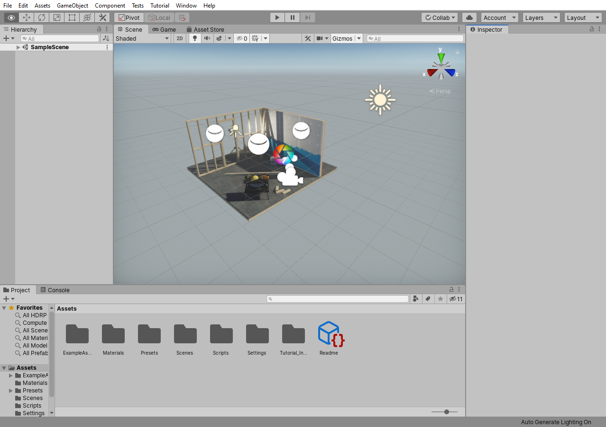
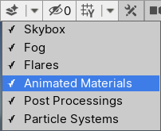
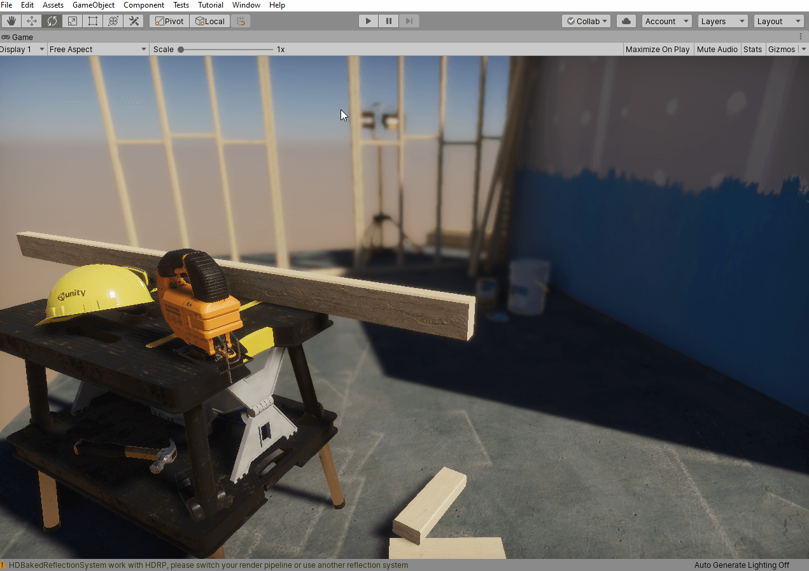

# Converting a Project from the Built-in Renderer to the High Definition Render Pipeline

The High Definition Render Pipeline (HDRP) uses a new set of [Shaders](https://docs.unity3d.com/Manual/class-Shader.html) and [lighting units](Physical-Light-Units.html), both of which are incompatible with the Built-in Renderer. To upgrade a Unity Project to HDRP, you must first convert all of your [Materials](#MaterialConversion) and Shaders, then adjust individual [Light](#LightAdjustment) settings accordingly.

This document explains how to convert the **3D With Extras** template Project to HDRP, but you can use the same workflow to convert your own Project. To follow this document and upgrade the **3D With Extras** Project, create a Project that uses the **3D With Extras** template. To do this:

1. Open the Unity Hub.

2. In the **Projects** tab, select **New**.

3. In the **Template **section, select **3D With Extras**.

4. Enter a **Project Name** and set the **Location** for Unity to save the Project to.

5. Click **Create**.

6. The Unity Editor opens and looks like this:

## Setting up HDRP

Firstly, to install HDRP, add the High Definition RP package to your Unity Project:

1. In the Unity Editor, open the Package Manager window (menu: **Window > Package Manager**).
2. Find and select the **High Definition RP** package, then click **Install**.

HDRP is now available to use in your Project. Note that when you install HDRP, Unity automatically attaches two HDRP-specific components to GameObjects in your Scene. It attaches the **HD Additional Light Data** component to Lights, and the **HD Additional Camera Data** component to Cameras. If you do not set your Project to use HDRP, and any HDRP component is present in your Scene, Unity throws errors. To fix these errors, see the following instructions on how to set up HDRP in your Project.

To set up HDRP, use the [Render Pipeline Wizard](Render-Pipeline-Wizard.html).

1. Open the Render Pipeline Wizard window (menu **Window > Render Pipeline > HD Render Pipeline Wizard**).

2. In the **Configuration Checking** section, go to the **HDRP** tab and click **Fix All**. This fixes every HDRP configuration issue with your Project.

HDRP is now set up inside your Project, but your Scene does not render correctly and uses the magenta error Shader to display GameObjects. This is because GameObjects in the Scene still use Shaders made for the Built-in Renderer. To find out how to upgrade Built-in Shaders to HDRP Shaders, see the [Upgrading Materials](#MaterialConversion) section.

HDRP includes its own [implementation for post-processing](Post-Processing-Main.html) and no longer supports the Post Processing package. If you are converting the **3D With Extras** Project, or if your own Project uses the Post Processing package, remove the Post Processing package from the Project. To do this:

1. In the Unity Editor, open the Package Manager window (menu: **Window > Package Manager**).

2. Find and select the** Post Processing **package, and click **Remove**.

For details on how to add and customize post-processing effects to the template Project, see the [post-processing](#Post-processing) section.

## Upgrading Materials

To upgrade the Materials in your Scene to HDRP-compatible Materials, either:

* **Upgrade Project Materials to High Definition Materials**: Converts every compatible Material in your Project to an HDRP Material.

* **Upgrade Selected Materials to High Definition Materials**: Converts every compatible Material currently selected in the Project window to an HDRP Material.

You can find these options in either:

* The **Edit > Render Pipeline **menu.

* The Render Pipeline Wizard window, inside the **Project Migration Quick-links** section.

This process can not automatically upgrade custom Materials or Shaders to HDRP. You must [convert custom Materials and Shaders manually](#ManualConversion).

### Converting Materials manually

The HDRP Material converter automatically converts Built-in Standard and Unlit Materials to HDRP Lit and Unlit Materials respectively. The process uses an overlay function to blend the color channels together, similar to the process you would use in image editing software, like Photoshop. To help you convert custom Materials manually, this section describes the maps that the converter creates from the Built-in Materials.

#### Mask maps

The Built-in Shader to HDRP Shader conversion process combines the different Material maps of the Built-in Standard Shader into the separate RGBA channels of the mask map in the HDRP [Lit Material](Lit-Shader.html). For information on which color channel each map goes in, see [mask map](Mask-Map-and-Detail-Map.html#MaskMap).

#### Detail maps

The Built-in Shader to HDRP Shader conversion process combines the different detail maps of the Built-in Standard Shader into the separate RGBA channels of the detail map in the HDRP [Lit Material](Lit-Shader.html). It also adds a smoothness detail too. For information on which color channel each map goes in, see [detail map](Mask-Map-and-Detail-Map.html#DetailMap).

## Adjusting lighting

HDRP uses [physical Light units](Physical-Light-Units.html) to control the intensity of Lights. These units do not match the arbitrary units that the Built-in render pipeline uses.

For light intensity units, directional Lights use [Lux](Physical-Light-Units.html#Lux) and all other Lights can use [Lumen](Physical-Light-Units.html#Lumen), [Candela](Physical-Light-Units.html#Candela), [EV](Physical-Light-Units.html#EV), or simulate Lux at a certain distance.

To set up lighting in your HDRP Project:

1. Add the default sky [Volume](Volumes.html) to your Scene to set up ambient lighting (menu **GameObject > Volume > Sky and Fog Volume**).
2. Set the [Environment Lighting](Environment-Lighting.html) to use this new sky:

    1. Open the Lighting window (menu: **Window > Rendering > Lighting Settings**).

    2. For the **Profile** property, select the same [Volume Profile](Volume-Profile) that the Sky and Fog Volume uses.

    3. For the **Static Lighting Sky** property, select **PhysicallyBasedSky**.

    4. Optionally, if you don't want Unity to re-bake the Scene''s lighting when you make the rest of the changes in this section, you can disable the **Auto Generate** checkbox at the bottom of the window.
3. Currently, the shadows are low quality. To increase their quality, you can change shadow properties:
    1. Create a new **Global Volume **GameObject (menu: **GameObject > Volume > Global Volume**) and name it **Global Settings**.

    2. Create a new Volume Profile for this Volume. To do this, open the Inspector for the Volume and click the **New** button.

    3. Add a **Shadows** override (**Add Override > Shadowing > Shadows**), then enable **Max Distance** and set it to **50**.
4. On the Light that represents the Sun (which is the Light component on the **Directional Light** GameObject), set the **Intensity** to **100000** and the **Color** to white. Then, to see the sun in the sky, go to the **General** panel, enable [More Options](More-Options.html), and set the **Angular Diameter** to **3**.
5. The Scene is now over-exposed. To fix this, select the **Global Settings** GameObject you created in step **3a** and add an **Exposure** override to its Volume component (**Add Override > Exposure**). Then, set the **Mode** to **Automatic**.
6. To refresh the exposure, go to the Scene view and enable **Animate Materials**.
    
7. Correct the Light cookie, because HDRP supports colored light cookies, and the Built-in light cookies use a texture format that only contains alpha:
    1. In the Project window, select **Assets > ExampleAssets> Textures > Light_Cookies > Spotlight_Cookie**.

    2. In the Inspector, change the import type from **Cookie** to **Default**.

    3. Set the **Wrap Mode** to **Clamp**. .
8. Correct the construction Light:
    1. In the Hierarchy window, select **ExampleAssets > Props > ConstructionLight > Spot Light** and view the Light component in the Inspector.

    2. Change the **Intensity** to **17000** **Lumen**. This is to represent two 8500 Lumen light bulbs.

    3. In the **Emission** section, enable [More Options](More-Options.html).

    4. Enable the **Reflector** checkbox. This simulates a reflective surface behind the spot Light to adjust the visual intensity.
9. Make the light bulb Material emissive:
    1. In the Project window, select **Assets/ExampleAssets/Materials/Lightbulb_Mat.mat**.

    2. In the **Emission Inputs** section of the Inspector, enable **Use Emission Intensity**, set **Emissive Color** to white, and set the **Emission Intensity** to **8500 Luminance**.
10. Finally, if you disabled **Auto Generate** in step **2d**, go to the Lighting window and press the **Generate Lighting** button. You can also re-enable **Auto Generate**.

## Post-processing

HDRP no longer supports the **Post Processing **package and instead includes its own [implementation for post-processing](Post-Processing-Main.html). To convert the Scene to HDRP post-processing:

1. In the Hierarchy, delete the** Post-process Volume** GameObject.

    1. If your Project used the Post Processing package's Scripting API to edit post-processing effects, you need to update your scripts to work with the new post-processing effects.
2. Create a new **Global Volume **GameObject (menu: **GameObject > Volume > Global Volume**) and name it "**Post-processes**". You can find all the post processes in the **Post-processing** sub-menu when you select **Add Override** in the Volume Inspector.
3. Add a **Tonemapping** override to the Volume (**Add Override > Post-processing > Tonemapping**) then enable **Mode** and set it to **ACES**.
4. Add a **Bloom** override to the Volume (**Add Override > Post-processing > Bloom**) then enable **Intensity** and set it to **0.2**.
    Note that the result of the bloom is not the same as the one in the Post Processing package. This is because HDRP's bloom effect is physically accurate, and mimics the quality of a camera lens.
5. Add a **Motion Blur** override to the Volume (**Add Override > Post-processing > Motion Blur**) then enable **Intensity** and set it to **0.1**.

6. Add a **Vignette** override to the Volume (**Add Override > Post-processing > Vignette**) then set the following property values.
    1. Enable **Intensity** and set it to **0.55**.

    2. Enable **Smoothness** and set it to **0.4**.

    3. Enable **Roundness** and set it to **0**.
7. Add a **Depth Of Field** override to the Volume (**Add Override > Post-processing > Depth Of Field**) then set the following property values:
    1. Enable **Focus Mode** and set it to **Manual**.

    2. In the **Near Blur** section, enable **Start** and set it to **0** then enable **End** and set it to 0.5

    3. In the **Far Blur** section, enable **Start** and set it to **2** then enable **End** and set it to **10**.
         Note that this effect is only visible in the Game view.
8. Finally, select the **Global Settings** GameObject to view it in the Inspector. In the Volume component, add an **Ambient** **Occlusion** override (**Add Override > Lighting > Ambient Occlusion**), then enable **Intensity** and set it to **0.5**.

## Result

Now the Scene in the Game view should look like this:

