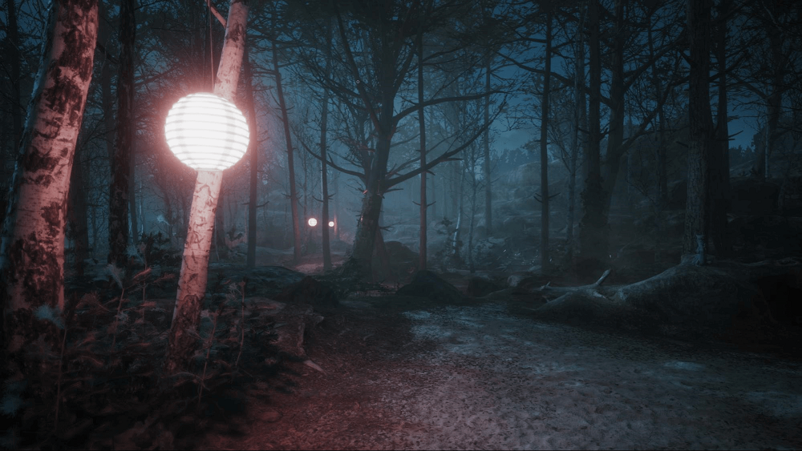

# High Definition Render Pipeline overview

The High Definition Render Pipeline (HDRP) is a high-fidelity Scriptable Render Pipeline built by Unity to target modern (Compute Shader compatible) platforms.

HDRP utilizes Physically-Based Lighting techniques, linear lighting, HDR lighting, and a configurable hybrid Tile/Cluster deferred/Forward lighting architecture. It gives you the tools you need to create applications such as games, technical demos, and animations to a high graphical standard. 

NOTE: Projects that you make with HDRP are not compatible with the Universal Render Pipeline (URP). You must decide which render pipeline your Project uses before you start development; HDRP features are not cross-compatible between HDRP and URP. 

This documentation contains the information you need to create applications using HDRP; including information on Lighting, Materials and Shaders, Cameras, and debugging.

HRDP is only supported on the following platforms: 

* Windows and Windows Store, with DirectX 11 or DirectX 12 and Shader Model 5.0
* Modern consoles (Sony PS4 and Microsoft Xbox One)
* MacOS using Metal graphics
* Linux and Windows platforms with Vulkan

**HDRP does not support OpenGL or OpenGL ES devices.**

**Note: HDRP only works on these platforms if the device used supports Compute Shaders.**